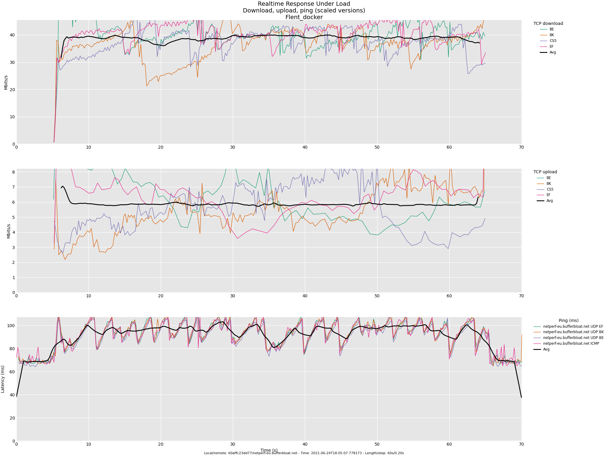

# flent-docker
Dockerized flent app for Realtime Response Under Load Network Test

If you have doubts about dockerizing flent due to its impact on results. Please compare below results.
Both were done with same source and destination hosts. Only difference is dockerized version of flent.



## Setup

### Building image
```sh
$ docker build -t <image_name> -f <Dockerfile> .
```
Example:
```sh
$ docker  build -t flent -f Dockerfile .
```

## Usage

### Running default test
```sh
$ docker run --rm --volume=<path_to_local_directory>:/data flent
```

Example:
```sh
$ docker run --rm --volume=/data:/data flent
```
Results and Test chart will be stored in <path_to_local_directory>

Above command will run flent with options:
```
$ flent   rrul \
        -p all_scaled \
        -l 60 \
        -H netperf-eu.bufferbloat.net \
        -o /data/RRUL_Test.png \
        --figure-width=20 \
        --figure-height=15 \
        -z
```


### Runing with different options
Flent can be run also with custom options
```sh
$ docker run --rm --volume=<path_to_local_directory>:/data flent <options>
```

Example:
```sh
$ docker run --rm --volume=<path_to_local_directory>:/data flent \ 
	rrul_torrent \
        -p totals \
        -l 30 \
        -H netperf-eu.bufferbloat.net \
        -o /data/RRUL_Test_Custom.png \
        --figure-width=20 \
        --figure-height=15 \
        -z
```

### Tests worth trying:
- rrul
- rrul_torrent
- rtt_fair
- tcp_12down


All available tests can be displayed with
```sh
$ flent --list-tests
```


## Help
```sh
$ docker run --rm --volume=<path_to_local_directory>:/data flent --help
```


### Inspired by:

[Bufferbloat - Wikiipedia](https://en.wikipedia.org/wiki/Bufferbloat)

[bufferbloat.net](https://www.bufferbloat.net/projects/bloat/wiki/Getting_SQM_Running_Right/)

[OpenWRT SQM configuration](https://openwrt.org/docs/guide-user/network/traffic-shaping/sqm)

